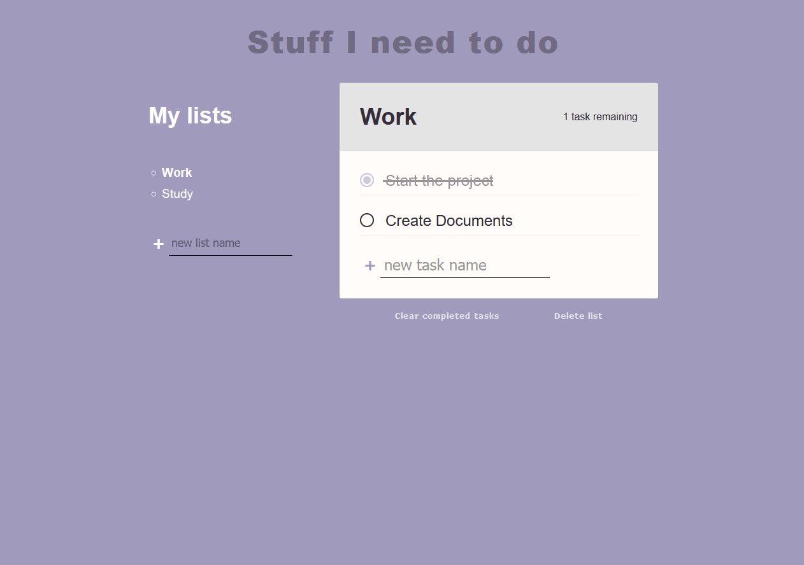

# ToDo List

## Description
In this project I created an interactive To Do List with vanilla Javascript.

Key concept used:
<ul>
<li>Dynamic event listeners</li>
<li>Re-rendering without a framework</li>
<li>Use LocalStorage to save website data</li>
</ul>
